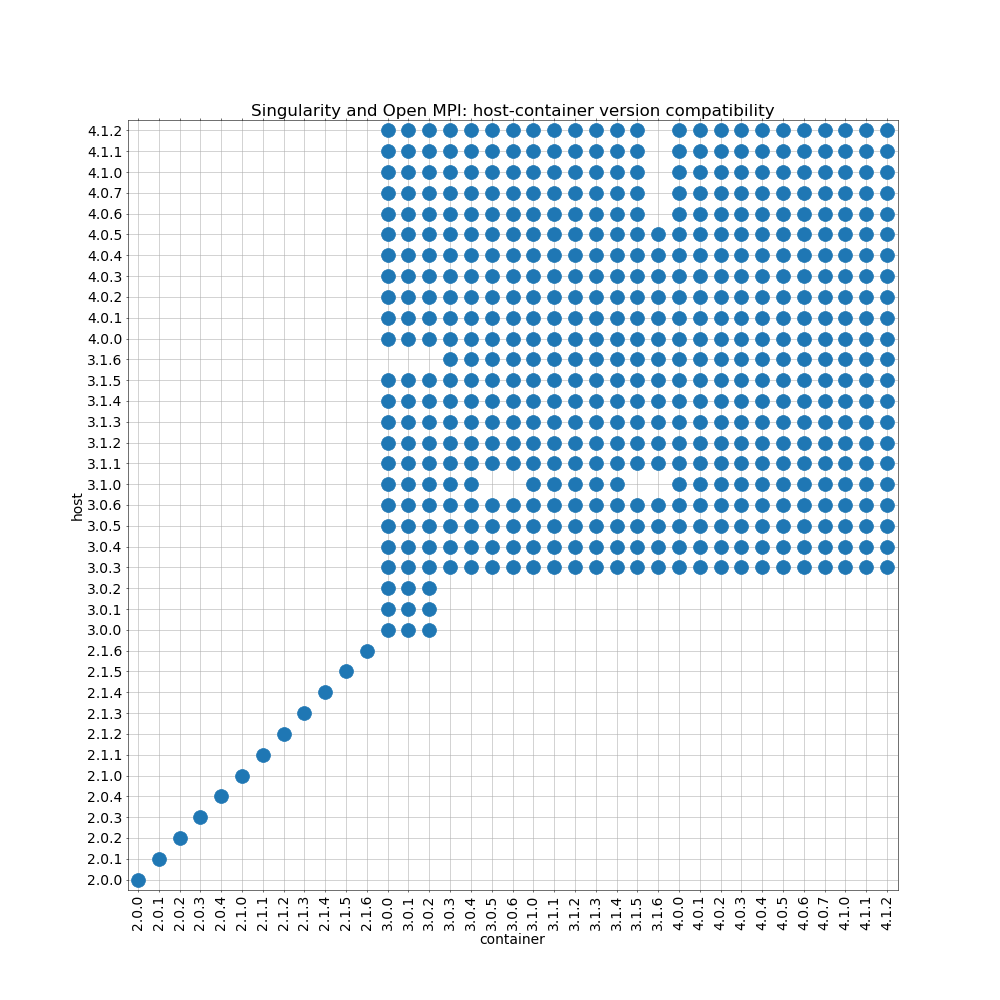

This repository contains scripts I used to try to document Open MPI
version compatibility between Open MPI installed *in a Singularity
container* and *on the host*.

To reproduce, run

    make host

to install Open MPI in `$HOME/opt/ompi-X.Y.Z`, then run

    make

to build Open MPI in a container, build tests, run tests, and generate
the plot.

See `openmpi.def` for a list of dependencies needed to build Open MPI
(dependencies on the host are the same). The plotting script uses
NumPy and Matplotlib.

The test used here is *very* primitive (prints the size of
`MPI_COMM_WORLD` on rank 0). I don't know if this is sufficient.
